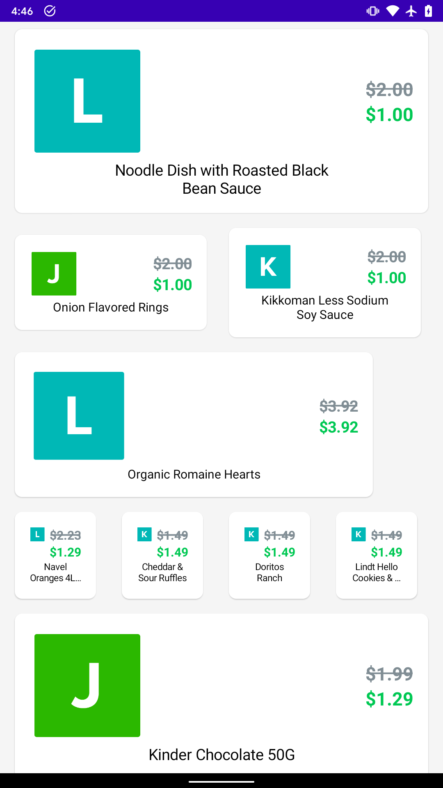
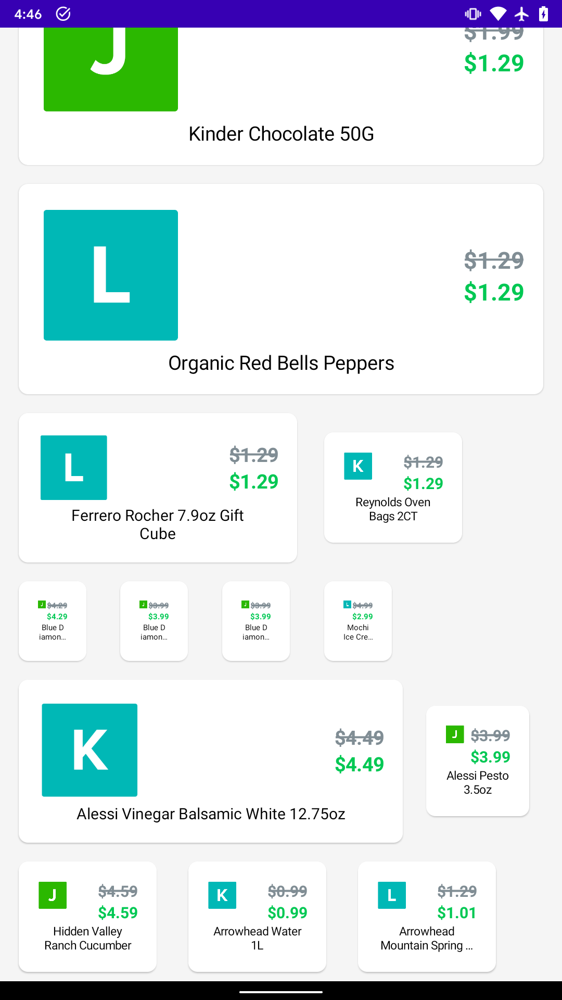

# Android app to fetch data from API and display in dynamically sized RecyclerView items

## Written in Kotlin with 
- Dependency injection 
- Retrofit
- Architectural components
- Coroutines + Flow
- View binding
- Firebase Cloud Messaging is used to send events, letting the app know that it needs to refresh its
data 

## Instructions
- Clone the repo
- Open in Android Studio
- Build and run
### With FCM
Use Postman or another REST client to make a request with following parameters
- POST
- https://fcm.googleapis.com/fcm/send
- Headers

|KEY|VALUE|
|---|---|
|Authorization|key=$key|
|Content-Type|application/json|
- Body
```
{
 "to" : "$token",
 "data" : {
     "eventType" : "101"
 }
}
```
- Replace $key and $token with the values in the email
- Hit the API request
### Without FCM
- Open the Injector class
- Replace `LocalEventManager()` with `MockEventManager()` in the following line
```
private val eventManager: EventManager = LocalEventManager()
```
- The `MockEventManager` class simulates receiving events from a service at random delays

## Screenshots

